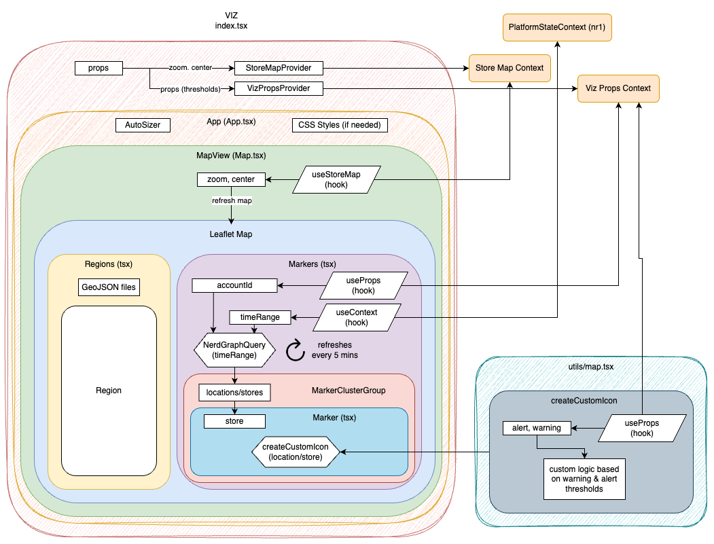

# Store Map Visualization

Store Map Visualization is a dynamic web application designed to visually represent sales data on a geographical map. This tool is particularly useful for businesses seeking to monitor sales performance across different store locations. It utilizes New Relic's custom visualization capabilities, alongside React and Leaflet, to provide a user-friendly and interactive map interface.


## Features

- **Dynamic Sales Data Visualization:** Visualize sales data from different store locations on an interactive map. Each store's performance is represented by customizable markers, with colors indicating different levels of sales performance.
- **Customizable Thresholds:** Set custom thresholds for sales performance indicators. Markers change color based on predefined sales ranges, providing an intuitive visual representation of each store's performance.
- **Interactive Map Clusters:** Store locations are clustered on the map for a cleaner visual representation. Clicking on a cluster zooms into that area, revealing individual store markers.
- **Real-time Data Updates:** The application periodically fetches and updates sales data, ensuring the information displayed is current and accurate.
- **Flexible Configuration:** Easily configure map zoom levels, center points, and other display options through a JSON configuration file.

## Architecture

The following diagram illustrates the architecture of the Store Map Visualization:



## Prerequisites

Before we start, make sure you have the following installed:

1. [Node.js](https://nodejs.org/) (>=12.13.0).
2. [New Relic CLI](https://one.newrelic.com/launcher/developer-center.launcher) (>=0.25.0).

Also, make sure you are logged in to your New Relic account. (alternatively check out the [Set up your development environment guide](https://developer.newrelic.com/build-apps/set-up-dev-env/)).

## Installation

Explain how to install the application, including any prerequisites or dependencies.

```bash
# clone this repository
git clone https://github.com/newrelic-experimental/store-map
# cd into the repository
cd store-map
# install dependencies
npm install
```

From here you can open your IDE and adjust configuration files as needed.

## Configuration
The Store Map Visualization is highly configurable, allowing users to tailor its behavior and appearance to their specific needs. Configuration is managed through two primary files: 
- `constants.ts` 
- `nr1.json`

### constants.ts
This file defines several key constants that control the default behavior of the map visualization:

`DEFAULT_ZOOM`: Sets the default zoom level of the map. Currently set to 1.
`DEFAULT_CENTER`: Specifies the default center point of the map. It is currently set to London's coordinates (`[51.5074, 0.1278]`).
`FETCH_INTERVAL`: Determines the interval in milliseconds at which the application fetches new data. It is set to 300,000 milliseconds (or 5 minutes), ensuring regular updates to the sales data visualized on the map.

### nr1.json
The `nr1.json` file is used for additional configuration, particularly for properties that can be adjusted within the New Relic visualization interface:

`accountId`: Allows the user to associate a specific account ID with the query, linking the map with relevant data sources.
`alert` and `warning`: These are threshold settings for sales data. 
- The alert threshold indicates a critical sales level, below which store markers will be colored red. 
- The warning threshold sets a cautionary level, below which store markers will be colored amber. If sales are above the warning level, markers will be colored green.

`zoom`: Offers a range of zoom levels (1 to 24) for the map, allowing users to control how closely they view the map data.
`center`: Determines the central point of the map. This is a dropdown menu in the UI, with each item representing a different city. 
- Adding more items to this property in the `nr1.json` file will provide additional options for centering the map. Currently, it includes major cities like London, Manchester, Edinburgh, and others.

By adjusting these configuration files, users can customize the Store Map Visualization to fit their unique data visualization needs. For instance, changing the `DEFAULT_CENTER` in `constants.ts` will alter the initial focus of the map, while adding more `center` options (items) in `nr1.json` expands the choices available for centering the map in the UI.

## Getting started 

### Local Development

Create a unique UUID for your visualization:
```
nr1 create --type uuid
```

Make any changes you need to the code.

Serve your app locally:
```
nr1 nerdpack:serve
```

And navigate to https://one.newrelic.com/?nerdpacks=local to see your changes.

For more detailed instructions on developing and serving locally, visit the [Serve your Nerdpack](https://developer.newrelic.com/build-apps/publish-deploy/serve) documentation page.

### Publishing your changes to New Relic One

Navigate to the project root directory and deploy your visualization:

```
nr1 nerdpack:publish
```

If everything is_successful, you'll see a message indicating that your visualization has been published.

For more detailed instructions on publishing your visualization, visit the [Publish your Nerdpack](https://developer.newrelic.com/build-apps/publish-deploy/publish) documentation page.

### Validate Deployment
To ensure that your visualization has been published successfully, use the following command:

```bash
nr1 nerdpack:list
```
You should see your visualization listed along with its UUID and version number.

### Subscribe Visualization to your Account
To make the visualization available for your account, use the following command:

```bash
nr1 nerdpack:subscribe
```

For more detailed instructions on subscribing your visualization, visit the [Subscribe to a Nerdpack](https://developer.newrelic.com/build-apps/publish-deploy/subscribe) documentation page.

#### To unsubscribe and unpublish your visualization

```bash
nr1 nerdpack:unsubscribe
nr1 nerdpack:undeploy
```